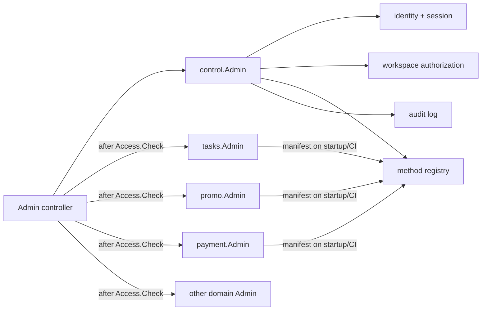

# Control

`control` -- центральный сервис управления рабочими пространствами и доступа к
административным методам. По устройству он такой же сервис, как `tasks`,
`promo`, `reference`, `payment`: Go-пакет с lifecycle, SQLC, `repository`,
`service/admin`, `service/internalapi` и тестами. HTTP,
контроллеры и маршрутизация остаются снаружи пакета.

Он не хранит доменные сущности `tasks`, `promo`, `payment`, `reference` и
других сервисов. Его ответственность: установить личность администратора,
определить его права в workspace, вести аудит и хранить единый каталог
административных методов.

## Цель и границы

### Control отвечает за

- аккаунты операторов, их внешние привязки, сессии, API-токены и 2FA;
- жизненный цикл workspace: создание, архивирование, участники и приглашения;
- роли, назначение ролей, иерархию ролей и правила доступа;
- реестр административных методов всех сервисов;
- проверку права до вызова метода;
- неизменяемый аудит административных действий;
- техническую авторизацию внутренних вызовов `control` из сервисов.

### Control не отвечает за

- выполнение бизнес-операции доменного сервиса;
- хранение доменных конфигураций workspace, например награды партнёра,
  задания или каталог товаров;
- пользовательские API и авторизацию конечного пользователя;
- передачу секретов из workspace в браузер.

Таким образом, `tasks` владеет настройками партнёров в workspace, а `control`
только решает, может ли оператор вызвать `tasks.admin.partner_config.upsert`.

## Что есть в старом коде

Старый модуль уже реализует большую часть предметной области:

- `account`, `account_bind`, `account_tokens`, `account_otp` -- оператор и
  аутентификация;
- `workspaces`, `workspace_accounts`, `workspace_links` -- workspace,
  членство и ссылки-приглашения;
- `workspace_role`, `workspace_role_account`, `workspace_role_access` -- RBAC
  и иерархия ролей;
- `access`, `access_group` -- каталог разрешений;
- `audit_log` -- аудит;
- контроллеры `workspace`, `role`, `account`, `token`, `twofactor`, `audit`.

Полезно перенести модель и сценарии, но не саму техническую форму:

- SQL stored procedures следует заменить на миграции, SQLC-запросы и
  транзакции в repository;
- строковые коды прав надо заменить на зарегистрированные method keys;
- все сервисные методы должны быть зарегистрированы через manifest, а не
  вручную добавляться в SQL dump;
- проверка доступа не должна зависеть от порядка строк в БД.

В старом `WORKSPACE_ACCESS_HAS` используются три состояния права и выбирается
первая роль по `position`, у которой право не `NOT_SET`. В новом сервисе
разрешение бинарное: method key либо включён у любой активной роли оператора,
либо не включён. Иерархия ролей проверяется отдельно для действий над людьми и
ролями.

## Структура пакета

```text
control/
  control.go                 # Control{Admin, Internal}, lifecycle
  config.go                  # DatabaseParams, Options, cache/codec/mutex adapters
  errors.go
  METHODS.md
  repository/
    repository.go            # Bootstrap, SQLC client, cache versions
    account.go               # accounts, identities, sessions, 2FA
    workspace.go             # workspace, members, invites
    role.go                  # roles, members, permissions, hierarchy
    method_registry.go       # manifests и каталог методов
    access.go                # проверка права и versioned cache
    audit.go                 # audit events
  service/
    admin/                   # auth, bind, 2FA, workspace, roles, permissions, audit
    internalapi/             # manifest registration, batched access check
  sqlc/
    schema.sql, query.sql, bootstrap.go, db.go, models.go
  tests/
    control_test.go, control_integration_test.go, control_benchmark_test.go
```

Верхний API-проект создаёт `control.New(...)` или `control.NewWithDatabase(...)`
так же, как остальные сервисы. Его контроллеры вызывают методы `Control.Admin`
и `Control.Internal`; сам пакет не импортирует Fiber и не знает про конкретные
URL.

## Взаимодействие сервисов



`control` -- единственный сервис, хранящий полный список административных
методов. Каждый доменный сервис знает только собственный manifest. Внешний
controller/adaptor сначала получает method metadata и решение доступа из
`control`, затем вызывает соответствующий Go-метод доменного сервиса. Это
сохраняет обычную для репозитория схему: бизнес-методы не принимают HTTP,
токены или transport-specific контекст.

Пользовательский API доменных сервисов остаётся отдельным и не проходит через
`control`.

## Функции авторизации

Ядро `control.Admin` не ходит во внешние OAuth/WebApp API напрямую: его метод
`CompleteAuth` принимает уже проверенную identity. Чтобы REST-проекту не
приходилось каждый раз вручную писать этот glue-code, рядом с сервисом есть
пакет `control/adapters`.

Основной сценарий -- простая функция на provider:

- REST handler получает `code`, `access_token`, Telegram `initData` или другой
  provider-specific ввод;
- вызывает `auth.Google`, `auth.GitHub`, `auth.TelegramWebApp` или другую
  provider-функцию;
- функция сама проверяет подпись или обменивает OAuth code на access token,
  получает профиль и нормализует данные;
- на выходе возвращается `admin.AuthIdentityParams`;
- REST handler передаёт эти параметры в `control.Admin.CompleteAuth`.

Так REST-слой получает готовый обработчик авторизации, а доменное ядро не
смешивается с SDK, endpoint-ами и callback URL конкретных платформ.

Пример подключения:

```go
identity, err := auth.Google(ctx, auth.OAuth2AuthParams{
    ClientID:     googleClientID,
    ClientSecret: googleClientSecret,
    Code:         codeFromCallback,
    RedirectURI:  redirectURI,
    IP:        requestIP,
    UserAgent: userAgent,
})
if err != nil {
    return err
}
result, err := control.Admin.CompleteAuth(ctx, identity)
```

Для каждого provider-а основной публичный API -- отдельная функция: `Google`,
`GitHub`, `GitLab`, `Yandex`, `VKID`, `TelegramWebApp`, `TONConnect`.
`NewGoogle`, `NewGitHub` и остальные provider-объекты остаются дополнительным
вариантом для редких случаев, когда нужен общий router `auth.Auth`. Внутри
часть OAuth-провайдеров может использовать общий строительный блок, но внешний
код не зависит от этого.

`TONConnect` скрывает backend-проверку `ton_proof`: payload/nonce, domain,
timestamp, соответствие `walletStateInit` адресу, извлечение wallet public key
из stateInit или через TON client fallback и Ed25519 signature. Если
`walletStateInit` не передан, необходимо передать TON client для on-chain
проверки; иначе identity не выдаётся.

## Реестр методов

У каждого административного метода есть постоянный key, например:

```text
control.workspace.create
control.workspace.member.remove
tasks.task.create
tasks.task.update
tasks.partner.config.upsert
promo.promo.create
payment.catalog.product.update
reference.item.upsert
```

Метод описывается manifest-ом, публикуемым самим сервисом:

```go
type MethodManifest struct {
    Key              string // "tasks.partner.config.upsert"
    Service          string // "tasks"
    InternalMethod   string // метод локального admin API
    Title            string
    Group            string
    WorkspaceScoped  bool
    Sensitive        bool // требует свежую 2FA-проверку
    RequestSchemaRev uint16
}
```

Manifest не даёт сервису права. Он только объявляет существующий метод.
`control` при старте и в CI принимает manifests, проверяет уникальность key,
совместимость схемы и сохраняет актуальный registry. Удаление метода сначала
помечает его `deprecated`, затем удаляется после того, как роли перестали на
него ссылаться.

В UI `control` отдаёт registry, отфильтрованный по правам оператора. Поэтому
фронт не ведёт собственный перечень разрешений и не узнаёт внутренние методы,
к которым у него нет доступа.

## Модель данных

Идентификаторы workspace сохраняем строковыми UUID/ULID. Это совместимо с уже
существующими сервисами, где `workspace_id` является `string`, и исключает
коллизии при переносе данных.

```text
accounts
  id, display_name, status, created_at, updated_at

account_identities
  id, account_id, provider, provider_subject, metadata, unique(provider, provider_subject)

sessions
  id, account_id, token_hash, expires_at, revoked_at, auth_version, last_used_at

workspaces
  id, slug, title, status(active|archived), created_by, created_at, updated_at

workspace_members
  workspace_id, account_id, status(active|removed), joined_at

roles
  id, workspace_id, code, title, description, position, is_owner, deleted_at

role_members
  role_id, account_id

method_registry
  method_key, service, internal_method, group_key, workspace_scoped,
  sensitive, schema_revision, status, registered_at

role_permissions
  role_id, method_key

workspace_auth_versions
  workspace_id, version

workspace_invites
  id, workspace_id, token_hash, role_ids, expires_at, max_uses, used_count, revoked_at

audit_events
  id, workspace_id, actor_id, method_key, target_type, target_id,
  request_id, before_data, after_data, result, occurred_at

audit_outbox
  id, audit_event_id, payload, published_at

service_credentials
  id, service, key_id, secret_hash/public_key, scopes, active, expires_at
```

`role_permissions` хранит только включённые методы. Отсутствие строки означает
отсутствие доступа. Нет состояний `DENIED` и `NOT_SET`, нет конфликтов между
ролями: если method key включён хотя бы у одной активной роли, базовое право
есть. Это не создаёт миллионы строк при добавлении нового метода в registry.

## Правила доступа

1. Из токена определяется `account_id` и выполняется проверка сессии.
2. `workspace_id` извлекается контроллером из маршрута, а не доверяется полю в
   произвольном JSON-body.
3. Проверяется активное членство в workspace.
4. Если у участника есть активная owner-роль, доступ разрешён для всех
   workspace-методов.
5. Иначе доступ разрешён, если method key включён хотя бы у одной его активной
   роли.
6. Иначе доступ запрещён.

### Иерархия ролей

`position` задаёт уровень роли: меньшее значение означает более высокий
уровень. У оператора effective position -- минимальный `position` среди его
активных ролей. Участник может иметь несколько ролей, поэтому его защищающий
уровень также равен минимальному `position`.

Метод с включённым правом всё ещё обязан пройти иерархическую проверку, если он
изменяет другого участника или роль:

- удалить участника, изменить его роли или отозвать его invite можно только,
  когда `actor_position < target_account_position`;
- выдать или снять роль можно только, когда
  `actor_position < target_account_position` **и**
  `actor_position < changed_role_position`;
- изменить, удалить, переместить или скопировать роль можно только, когда
  `actor_position < target_role_position`;
- нельзя создать роль на уровне своей роли или выше; новая роль всегда должна
  иметь `position` строго ниже effective position создателя;
- owner-роль принадлежит только создателю/системе и не выдаётся обычными
  role-методами.

Поэтому модератор с правом `Workspace.Role.Member.Set` не сможет выдать роль
другому модератору, себе или участнику уровнем выше: наличие method key даёт
доступ к операции, но не отменяет ограничение иерархии.

При изменении ролей, membership или прав увеличивается
`workspace_auth_versions.version`. Кэш решения (`workspace_id`, `account_id`,
`method_key`, `version`) может жить 1--5 секунд в memory/Redis. После изменения
версии старые ключи не используются, поэтому revoke действует сразу без
массового удаления кэша. Для особо чувствительных методов (`sensitive=true`)
можно отключить кэш и требовать подтверждение 2FA, например не старше 5 минут.

## Вызов доменного метода

Контроллер внешнего API не хранит список прав в коде. Для вызова
`tasks.partner.config.upsert` он использует key из registry и работает в
следующем порядке:

1. извлекает operator session через `Control.Admin`;
2. вызывает `Control.Internal.CheckAccess` с `accountID`, `workspaceID` и
   method key;
3. при `allowed=true` вызывает `Tasks.Admin.SavePartnerConfig`;
4. записывает результат через доверенный `Control.Internal.AppendAudit`.

Сетевой API может жить отдельным приложением, но всё остаётся обычными
типизированными вызовами сервисов. Если сервисы будут разнесены по процессам,
этот же adapter заменит прямой вызов на внутренний клиент; это не меняет
контракт `control` и не добавляет transport-логику в `service/*`.

## Слои и методы

### `service/admin`

- `Admin.AuthStart`, `Admin.AuthComplete`, `Admin.Logout`, `Admin.Refresh`
- `Admin.TwoFactorBegin`, `Admin.TwoFactorConfirm`, `Admin.TwoFactorDisable`
- `Admin.ListSessions`, `Admin.RevokeSession`, `Admin.RevokeAllSessions`
- `Admin.GetMe`, `Admin.ListIdentities`, `Admin.BindIdentity`,
  `Admin.UnbindIdentity`

Первая версия переносит текущие сценарии авторизации и привязки без изменения
их смысла: GitHub, GitLab, Google, VK и Yandex создают либо находят `account`,
после чего выдают session; уже авторизованный оператор может привязать или
отвязать дополнительный provider. Сессии хранятся по hash токена, поддерживают
отзыв всех/одной сессии и опциональную привязку к IP, как в старом коде.

TOTP, подтверждение второго фактора и backup-коды также входят в первую версию.
TON Connect пока не является частью контракта и не блокирует запуск: его позже
нужно добавить отдельным adapter-ом `IdentityProvider`, не меняя accounts,
sessions или roles. Для этого в `account_identities.provider` сразу используется
строковый provider key, а не закрытый enum.

- `Admin.CreateWorkspace`, `Admin.GetWorkspace`, `Admin.ListWorkspaces`,
  `Admin.UpdateWorkspace`, `Admin.ArchiveWorkspace`
- `Admin.ListMembers`, `Admin.RemoveMember`
- `Admin.CreateInvite`, `Admin.ListInvites`, `Admin.RevokeInvite`
- `Admin.CreateRole`, `Admin.UpdateRole`, `Admin.DeleteRole`, `Admin.ListRoles`
- `Admin.SetRoleMember`, `Admin.RemoveRoleMember`
- `Admin.ListRolePermissions`, `Admin.SetRolePermission`,
  `Admin.ClearRolePermissions`
- `Admin.ListMethods`, `Admin.GetMethod`
- `Admin.ListAudit`

### `service/internalapi`

- `Internal.RegisterManifest` -- принимает manifest только от доверенного
  доменного сервиса.
- `Internal.CheckAccess` -- возвращает решение для одного или пачки method key.
- `Internal.GetAuthorizedMethods` -- возвращает доступные оператору методы.
- `Internal.AppendAudit` -- записывает аудит действия, выполненного доверенным
  API-оркестратором в другом сервисе.

## Что переносим из старого control

| Старый блок | Новый владелец/эквивалент |
| --- | --- |
| OAuth GitHub/GitLab/Google/VK/Yandex | `Identity` adapters в control, включая bind/unbind |
| `account_tokens`, IP-binding, revoke | `sessions` |
| TOTP и backup-коды | `TwoFactor` |
| `workspaces`, links, members | `Workspace`, `workspace_invites` |
| `workspace_role*` | `roles`, `role_members`, `role_permissions` |
| `access`, `access_group` | `method_registry`, `group_key` |
| `audit_log` | append-only `audit_events` + outbox |
| `setting*` | не переносить как общий KV-store; настройки остаются у владельца-домена |
| `calendar` и `reference` контроллеры | не размещать в control, вызывать как доменные сервисы |

## Миграция

1. Создать `control` в текущем репозитории по шаблону соседних сервисов:
   `control.go`, `config.go`, `repository`, `service/admin`,
   `service/internalapi`, `sqlc`, `tests`, `METHODS.md`.
2. Перенести accounts, identities, sessions, текущие OAuth/bind сценарии, 2FA,
   workspaces и audit. Старые числовые IDs можно сохранить как legacy mapping,
   новые workspace IDs выдавать строкой.
3. Импортировать роли, участников и только `ALLOWED` права; `DENIED` и
   `NOT_SET` не переносятся, поскольку в новой модели отсутствие записи уже
   означает отсутствие доступа.
4. Добавить manifests к `tasks`, `promo`, `payment`, `reference`, `calendar`,
   `cpa`. Каждый сервис публикует только свои admin-методы.
5. Перевести admin controllers на общий helper: `Control.Internal.CheckAccess`
   перед вызовом конкретного `X.Admin.Method`.
6. Подключить helper сначала для одного сервиса, покрыть integration и
   revoke-cache тестами, затем мигрировать остальные.
7. После переключения UI удалить старые control controllers и stored procedures.

## Критичные тесты

- метод разрешён, если он включён хотя бы у одной активной роли, и запрещён,
  если не включён ни у одной;
- модератор с правом назначения роли не может менять участника равного или
  более высокого уровня и не может выдавать роль равного или более высокого
  уровня;
- удаление участника или роли мгновенно делает ранее выданный cache key
  недействительным через auth version;
- controller не может вызвать незарегистрированный method key;
- контроллер не вызывает доменный admin-метод, пока `CheckAccess` не вернул
  разрешение;
- изменение роли, выдача invite, вызов и неуспешный вызов оставляют audit event;
- manifest с дублирующимся key или несовместимой schema revision отклоняется.
